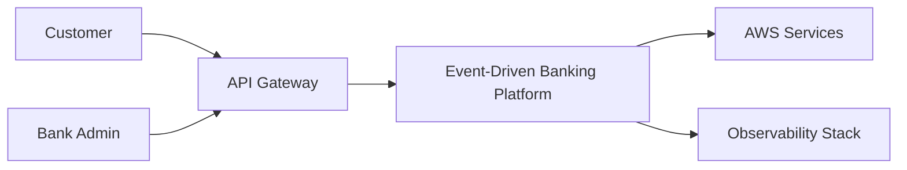
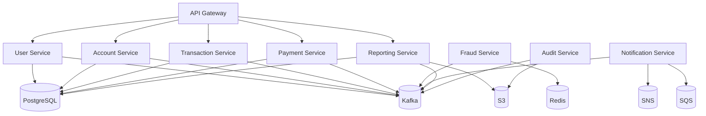
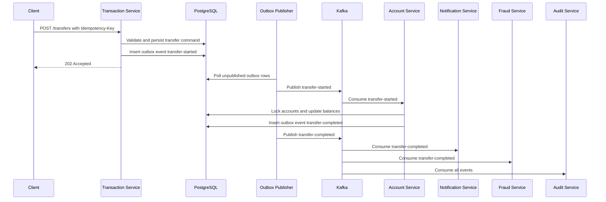

# Architecture

## Architecture Style

The platform uses service-level Domain-Driven Design with Hexagonal Architecture.

Each service separates:

- Domain model: aggregates, value objects, domain services, domain events
- Application layer: use cases, command handlers, query handlers, transaction orchestration
- Ports: repository, event publisher, cloud storage, notification, identity, clock
- Adapters: REST controllers, Kafka consumers/producers, JPA repositories, Redis, AWS clients

## System Context

## Container View

## Service Communication

Synchronous calls are used only when the caller needs an immediate command result. Cross-service state propagation uses Kafka.

Rules:

- Commands enter through REST.
- Domain changes are persisted in the service database.
- Integration events are written to Outbox in the same transaction.
- Outbox publisher sends events to Kafka.
- Consumers are idempotent.
- Long-running workflows use Saga choreography first, orchestration only when compensation rules become complex.

## Money Transfer Flow

## Bounded Contexts

| Context | Owner Service | Core Concepts |
| --- | --- | --- |
| Identity | User Service | User, Role, Credential, Refresh Token |
| Accounts | Account Service | Account, Balance, Account Status, Ledger Entry |
| Transactions | Transaction Service | Transfer, Deposit, Withdrawal, Idempotency Request |
| Payments | Payment Service | Scheduled Payment, Recurring Instruction, Payment Attempt |
| Fraud | Fraud Service | Rule, Alert, Risk Score, Windowed Activity |
| Notifications | Notification Service | Notification, Template, Delivery Attempt |
| Reporting | Reporting Service | Statement, Report Job, Materialized View |
| Audit | Audit Service | Audit Event, Event Archive, Compliance Trail |

## CQRS

Use CQRS selectively:

- Commands validate intent and mutate aggregates.
- Queries use read models optimized for account summaries, statements, fraud dashboards, and audit views.
- Reporting Service builds materialized views from Kafka events.

## Resilience

Use Resilience4j for:

- External service clients
- AWS adapters
- Notification provider adapters
- Report upload operations

Use Kafka retry topics and DLQ for asynchronous processing failures.

## Observability

Every service emits:

- JSON logs with `correlationId`, `traceId`, `spanId`, `customerId` where safe, and `eventId`
- Micrometer metrics
- OpenTelemetry traces
- Actuator health and readiness probes

