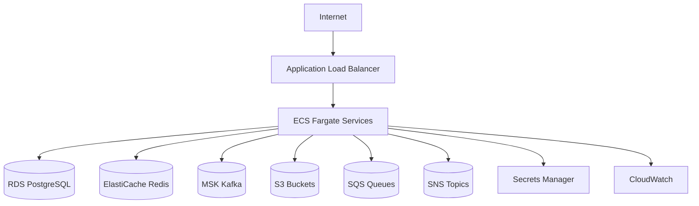

# AWS Architecture

## Target Mapping

| Capability | AWS Service |
| --- | --- |
| Container hosting | ECS Fargate or EKS |
| Relational database | RDS PostgreSQL |
| Cache | ElastiCache Redis |
| Event streaming | MSK Kafka or self-managed Kafka on EKS |
| Object storage | S3 |
| Retry queues and DLQ | SQS |
| Notifications | SNS |
| Secrets | Secrets Manager |
| Logs and metrics | CloudWatch |
| Container registry | ECR |
| Network boundary | VPC, private subnets, security groups |
| Infrastructure as code | Terraform |

## Deployment View

## S3 Buckets

- `bank-platform-statements`
- `bank-platform-reports`
- `bank-platform-audit-archive`

Enable:

- Server-side encryption
- Versioning for audit archives
- Lifecycle policy for long-term archival
- Block public access

## SQS

Queues:

- `notification-retry-queue`
- `report-generation-retry-queue`
- `bank-platform-dead-letter-queue`

Use SQS for operational retries that are not part of Kafka stream processing.

## SNS

Topics:

- `customer-notifications`
- `fraud-alerts`
- `operations-alerts`

## Secrets Manager

Secrets:

- PostgreSQL credentials
- JWT signing key or key reference
- Provider credentials for email/SMS adapters
- Kafka credentials if MSK IAM auth is not used

## CloudWatch

Dashboards:

- API latency
- Error rate
- JVM memory and GC
- Kafka consumer lag
- RDS CPU and connections
- DLQ depth

Alarms:

- High 5xx rate
- High p95 latency
- Kafka lag threshold exceeded
- RDS storage low
- DLQ has messages

## IAM Principles

- Service-specific task roles
- S3 write permissions limited to required bucket and prefix
- Secrets read permissions limited to required secret ARNs
- SNS publish permissions limited to required topics
- SQS send/receive permissions limited to required queues

## LocalStack

Use LocalStack locally for:

- S3 report upload
- SQS retry queue integration
- SNS notification integration
- Secrets Manager development fallback

