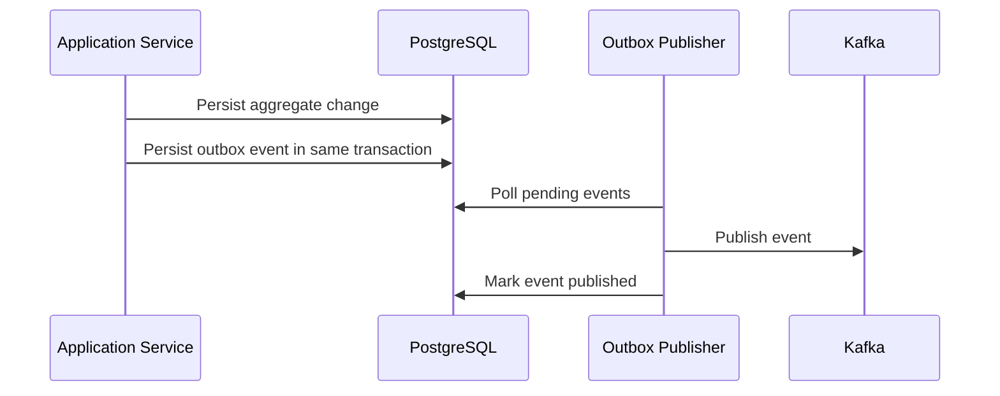
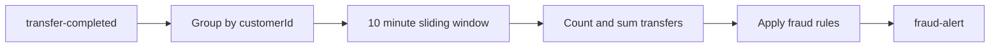

# Kafka Design

## Topic List

| Topic | Producer | Consumers |
| --- | --- | --- |
| `user-created` | User Service | Account, Notification, Audit |
| `user-updated` | User Service | Notification, Audit |
| `account-created` | Account Service | Notification, Reporting, Audit |
| `account-closed` | Account Service | Reporting, Audit |
| `money-deposited` | Account Service | Transaction, Reporting, Audit |
| `money-withdrawn` | Account Service | Transaction, Reporting, Audit |
| `transfer-started` | Transaction Service | Account, Fraud, Audit |
| `transfer-completed` | Account Service or Transaction Service | Notification, Fraud, Reporting, Audit |
| `transfer-failed` | Transaction Service | Notification, Reporting, Audit |
| `payment-created` | Payment Service | Notification, Audit |
| `payment-success` | Payment Service | Transaction, Notification, Reporting, Audit |
| `payment-failed` | Payment Service | Notification, Reporting, Audit |
| `fraud-alert` | Fraud Service | Notification, Audit, Account |
| `notification-requested` | Any service | Notification |
| `audit` | All services | Audit |
| `dead-letter` | Retry handlers | Audit, Operations |

## Event Envelope

```json
{
  "eventId": "uuid",
  "eventType": "transfer-completed",
  "eventVersion": 1,
  "occurredAt": "2026-07-18T13:00:00Z",
  "producer": "transaction-service",
  "correlationId": "uuid",
  "causationId": "uuid",
  "aggregateType": "Transfer",
  "aggregateId": "uuid",
  "partitionKey": "account-id-or-customer-id",
  "payload": {}
}
```

## Partitioning

Use partition keys that preserve ordering where required:

- Account events: `accountId`
- Transfer lifecycle events: `transferId`
- Customer activity events: `customerId`
- Fraud windows: `customerId`

Money movement logic must not rely on global topic ordering.

## Outbox Pattern



Outbox table columns:

- `id`
- `aggregate_type`
- `aggregate_id`
- `event_type`
- `event_version`
- `payload`
- `headers`
- `status`
- `created_at`
- `published_at`
- `attempt_count`
- `last_error`

## Retry and DLQ

Consumer policy:

- Retry transient failures with exponential backoff.
- Do not retry validation or schema errors indefinitely.
- Send poison messages to service-specific DLQ topics or a common `dead-letter` topic with original headers.

## Schema Evolution

Rules:

- Events are immutable once published.
- Additive payload changes are backward compatible.
- Breaking changes require a new event version.
- Consumers ignore unknown fields.
- Include contract tests for published event shapes.

## Kafka Streams Fraud Windows

Example:



